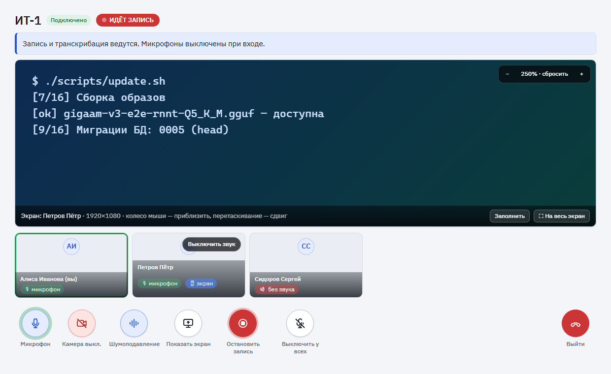
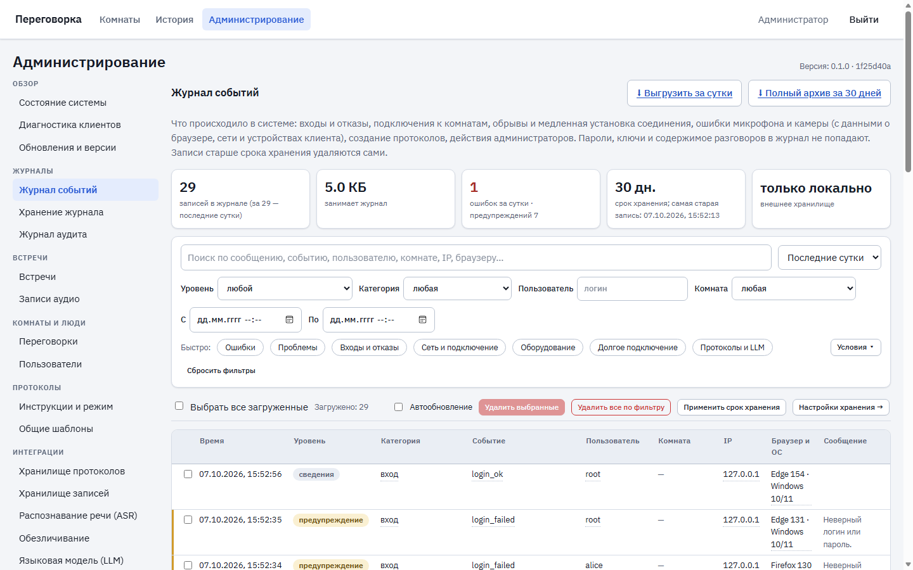
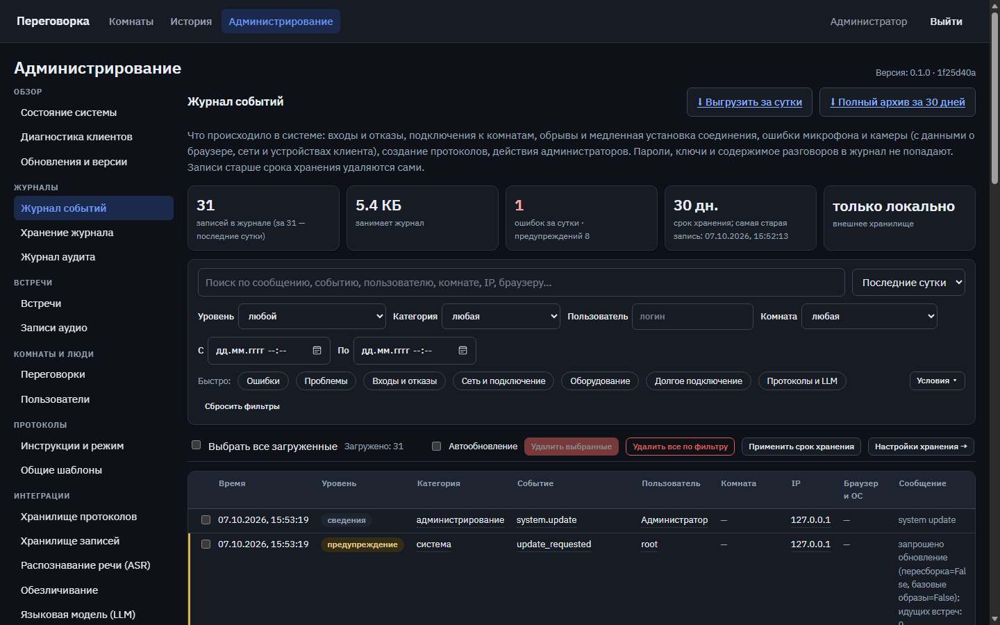
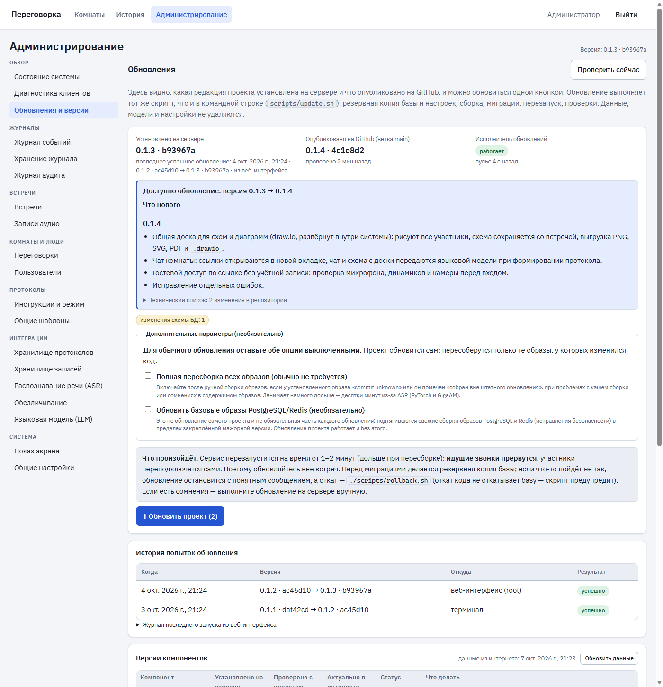
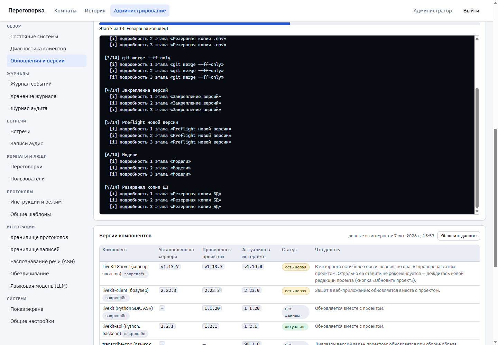
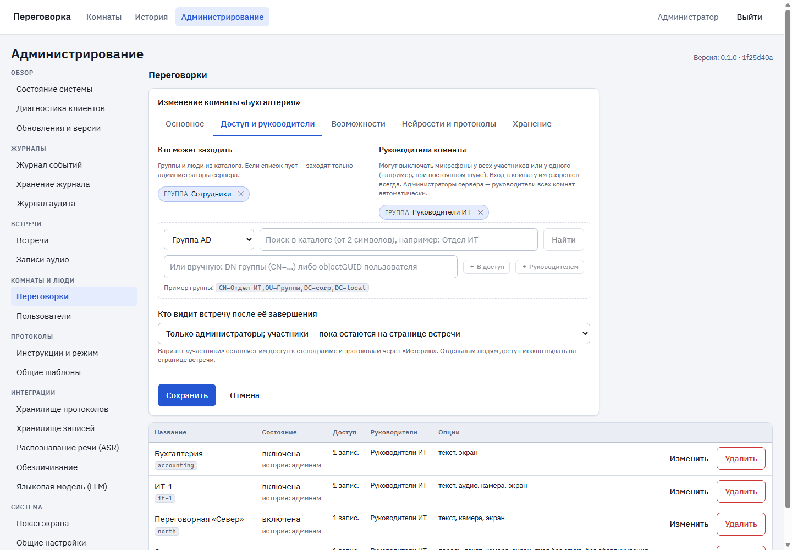
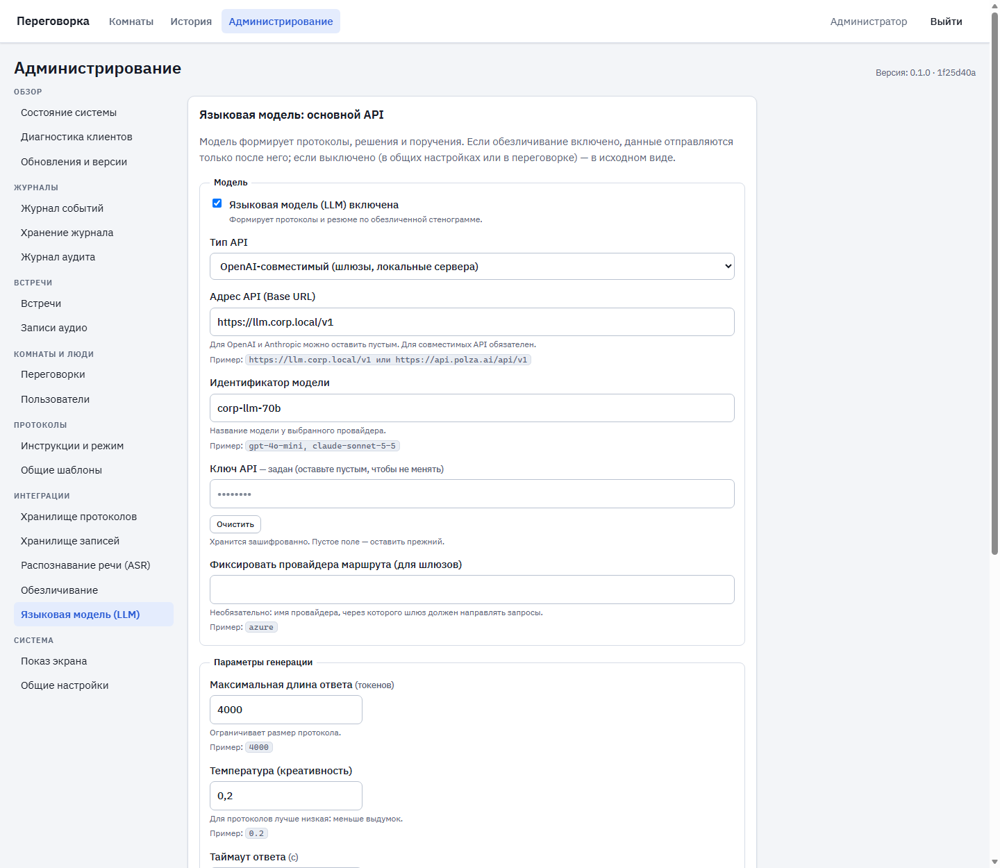
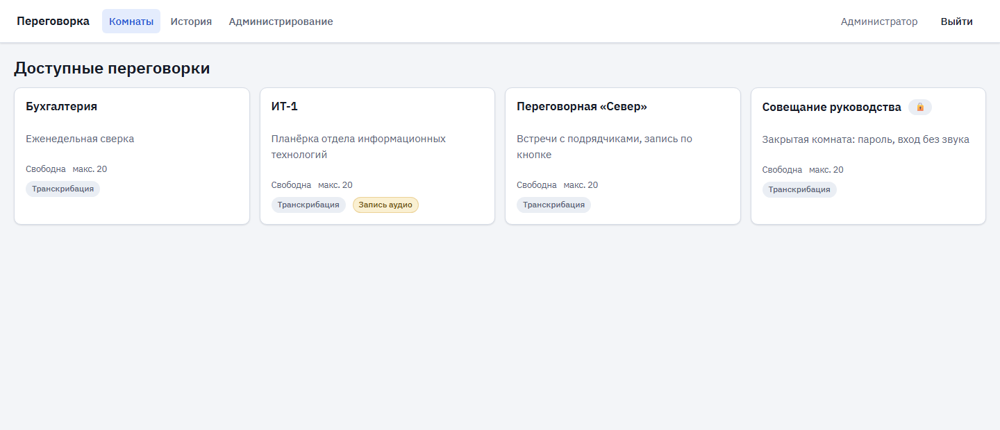
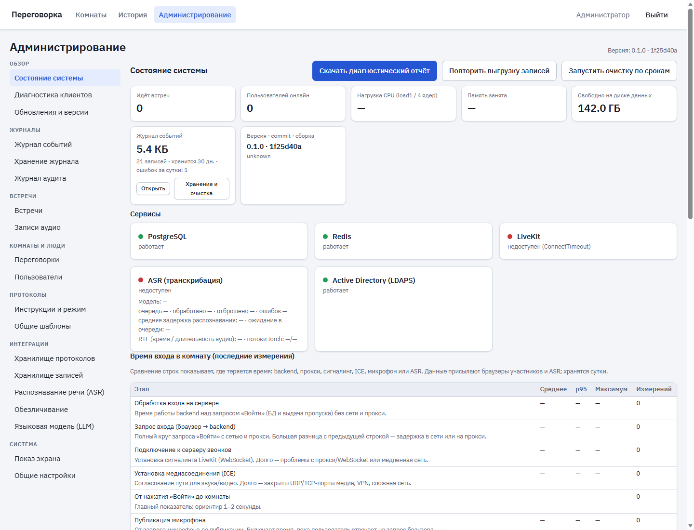
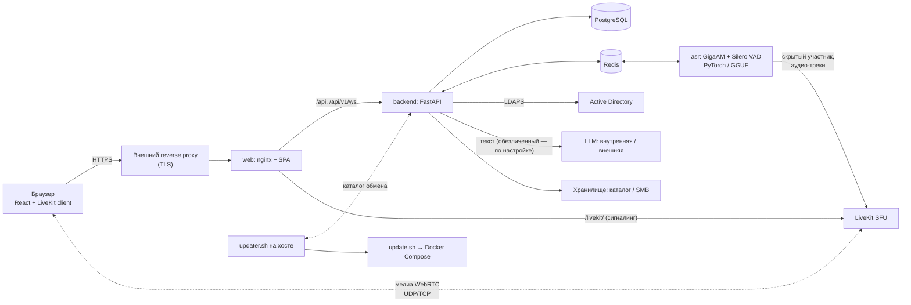

<div align="center">

# 🎙 Peregovorka

### Локальная голосовая переговорка с транскрибацией, протоколами и полным контролем над данными

Видео- и аудиовстречи для корпоративной сети: вход доменной учётной записью, распознавание речи **каждого участника отдельно**,
протоколы по инструкции, журнал для диагностики и обновление в один клик. Никаких облаков для звонков и распознавания — всё работает на вашем сервере.

[](https://github.com/leonheard/peregovorka/actions)




<sub>Комната: показ экрана (колесо мыши — масштаб), плитки участников, круглые кнопки управления. Макет интерфейса, отрисованный боевыми стилями.</sub>

</div>

---

## Содержание

1. [Коротко](#коротко)
2. [Возможности](#возможности)
3. [Интерфейс](#интерфейс)
4. [Как это устроено](#как-это-устроено)
5. [Требования](#требования)
6. [Быстрая установка](#быстрая-установка)
7. [Обновление и откат](#обновление-и-откат)
8. [Ежедневная эксплуатация](#ежедневная-эксплуатация)
9. [Конфигурация](#конфигурация)
10. [Безопасность и конфиденциальность](#безопасность-и-конфиденциальность)
11. [Данные и хранилище](#данные-и-хранилище)
12. [Версии и совместимость](#версии-и-совместимость)
13. [Качество и проверки](#качество-и-проверки)
14. [Документация](#документация)
15. [Состав репозитория](#состав-репозитория)
16. [Разработка и тесты](#разработка-и-тесты)
17. [Статус и известные ограничения](#статус-и-известные-ограничения)

---

## Коротко

| | |
| --- | --- |
| **Что это** | Веб-система переговорных комнат для локальной сети: голос, видео, показ экрана, стенограмма «кто что сказал», протоколы встреч |
| **Для кого** | Организации, где разговоры и документы не должны покидать периметр: ИТ-отделы, руководство, юристы, бухгалтерия, госструктуры |
| **Вход** | Доменная учётная запись Active Directory (LDAPS), права на комнаты — по группам AD |
| **Звонки** | Собственный сервер LiveKit (WebRTC), закреплённая проверенная версия |
| **Речь → текст** | GigaAM v3 E2E RNNT + Silero VAD, на вашем CPU или GPU; две модели на выбор: Full (PyTorch) и компактная Q5_K_M (GGUF) |
| **Протоколы** | Через LLM по инструкции пользователя; обезличивание — по желанию, глобально или для каждой комнаты |
| **Установка** | Одна команда с мастером; соседствует с другими проектами сервера, не трогая их |
| **Обновление** | `./scripts/update.sh` или кнопка в веб-интерфейсе с подробным ходом обновления |

## Возможности

### 🎥 Комната и связь

- **Голос, видео и показ экрана** на LiveKit (WebRTC). Состояние каждого участника — микрофон, камера, «говорит сейчас» — видно текстом и цветом.
- **Круглые кнопки-пиктограммы** с подписями и эффектами: микрофон, камера, шумоподавление, показ экрана, запись, «выключить у всех», выход. Состояния читаются без текста: включено, выключено, идёт трансляция, идёт запись.
- **Просмотр чужого экрана как в просмотрщике изображений:** колесо мыши приближает и отдаляет к точке под курсором, перетаскивание сдвигает, «щипок» на сенсорном экране, клавиши `+` `−` `0` и стрелки.
  Меньше исходного размера отдалить нельзя, приближение ограничено разумным пределом (×3…×10 в зависимости от разрешения источника), сдвиг — краями кадра. При увеличении запрашивается слой высокого качества.
- **Профили показа экрана:** «Чёткость» (слайды, текст, код), «Сбалансированный», «Плавность» (видео).
- **Микрофон без «драки»:** шумоподавление, эхоподавление и автоусиление переключаются «на лету»; можно освобождать микрофон при выключении. Если микрофон занят другой программой (в том числе в «монопольном режиме» Windows),
  вход не блокируется — вы остаётесь в комнате без звука, видите причину и можете повторить или выбрать другое устройство.
- **Устойчивое подключение:** при сетевых сбоях и ошибках ICE (`could not establish pc connection`) первое подключение повторяется автоматически; данные о сети клиента попадают в журнал для разбора.
- **Этапы входа** показываются по шагам; вход не ждёт готовности распознавания — микрофон публикуется параллельно.
- **Приветствие при входе** и режим «микрофон при входе выключен» — для больших встреч.

### 🧩 Общая доска, чат и гости

- **Общая доска со схемами — draw.io** ([jgraph/drawio](https://github.com/jgraph/drawio), Apache-2.0), развёрнутый у нас и встроенный в комнату: кнопка «Доска», не выходя из звонка. Фигуры, стрелки, связи, текст, цвета, отмена/повтор,
  масштабирование — всё готовое. Правки видны всем участникам сразу (протокол `diffSync` самого draw.io; порядок задаёт сервер), схема сохраняется вместе со встречей **как XML draw.io** — её можно открыть и
  продолжить править. Выгрузка PNG, SVG, PDF и `.drawio`; в истории встречи видно, что доска использовалась, и схему можно открыть. Редактор работает офлайн и в «песочнице» без доступа к приложению.
- **Чат комнаты** — компактная панель рядом со стенограммой: автор, время, кликабельные ссылки (всегда в новой вкладке), копирование, история встречи. Чат — **отдельный источник для протокола**: адреса, имена серверов,
  номера задач и точные формулировки передаются языковой модели дословно вместе со стенограммой и описанием схемы с доски.
- **Гостевой доступ по ссылке** (включается для каждой комнаты): гость без учётной записи вводит имя, проверяет микрофон (индикатор уровня), динамики и камеру и входит в идущую встречу как «Иван Иванов (гость)». Это отдельный
  тип участника с минимальными правами; ссылку можно перевыпустить или отозвать (гости отключаются), не удаляя комнату.
- **Вкладка с комнатой не используется для переходов:** «История», «Администрирование», ссылки из чата и протоколов открываются в новой вкладке — звонок не прерывается. Подробнее — [docs/COLLABORATION.md](docs/COLLABORATION.md).

### 👑 Руководители комнат

- В настройках комнаты назначаются **руководители** (группы AD и отдельные люди). Они выключают микрофоны **у всех участников одной кнопкой** (себя не трогает) или **у конкретного** — например, при постоянном шуме.
- Администраторы сервера — руководители всех комнат автоматически. Руководителю вход разрешён и вне списка доступа.
- Участник видит уведомление и может включить микрофон сам; все действия записываются в аудит и журнал.

### 📝 Транскрибация

- **Каждый участник распознаётся отдельно** (отдельный микрофонный трек): в панели видно, кто и что сказал, со временем реплики.
- **GigaAM v3 E2E RNNT + Silero VAD** — русская речь, без интернета. Две модели на выбор из админки без перезапуска сервисов:
  **Full (PyTorch)** — эталон качества, и **Q5_K_M (GGUF)** — компактная и быстрая на CPU (движок [transcribe.cpp](https://github.com/handy-computer/transcribe.cpp) встроен в образ).
  Проверено на реальной модели Q5_K_M: ошибка 4,5 % слов на тестовой записи, 0,24× от реального времени на старом 4-ядерном процессоре.
- **Измерения в админке:** «Протестировать модель» и «Сравнить модели» — скорость, коэффициент реального времени, загрузка CPU, память, качество слов (WER/CER), пунктуация.
- **Настройка сегментации** (пауза речи, минимальная длительность и др.) меняется на лету; тайминги каждого сегмента пишутся в журнал.

### 📋 Встречи, записи, протоколы

- **История встреч** с транскриптом по времени и участникам; доступ к завершённой встрече — по правилам (участники, администратор, явные права, окно после встречи).
- **Запись** беседы по кнопке или автоматически, аудио по участникам, раздельные сроки хранения текста и аудио.
- **Протокол и краткое резюме** через LLM по инструкции, которую пользователь подтверждает перед отправкой; шаблоны инструкций (общие и личные); просмотр, правка, удаление; экспорт в Markdown, TXT, DOCX, PDF.
- **Выгрузка** в локальный каталог или на **SMB-ресурс** по структуре «комната / дата, день недели / время». Недоступное хранилище не теряет запись: файл остаётся, выгрузка повторяется.

### 🧠 Нейросети: несколько API и обезличивание по желанию

- **Несколько API** для языковой модели и для обезличивания: внутренний и внешний, основной и резервный. Один отмечается «по умолчанию для всех», а конкретной переговорке можно назначить свой.
- **Обезличивание необязательно.** Пока оно включено, в LLM уходит только обезличенный текст, а при сбое протокол не создаётся (данные наружу не уходят). Выключено — протоколы создаются как обычно, а окно подтверждения честно предупреждает, что текст уходит как есть.
  Режим задаётся для всей системы или для комнаты: наследовать / всегда / выключено.

### 🛠 Администрирование

- Разделы сгруппированы по задачам: **Обзор · Журналы · Встречи · Комнаты и люди · Протоколы · Интеграции · Система**. У каждого поля есть пояснение и пример заполнения.
- **Форма комнаты на вкладках** (основное · доступ и руководители · возможности · нейросети · хранение): доступ и руководители редактируются списками с поиском по каталогу AD.
- **Состояние системы:** ресурсы, сервисы, ASR, версии, время входа по этапам, размер журнала, диагностический отчёт **без секретов** одним нажатием.
- Длинные списки — **бесконечной лентой**, без страниц.

### 📚 Журнал событий

- Что происходило: входы и отказы, подключения, обрывы и медленная установка соединения, ошибки микрофона и камеры (с данными о браузере, сети и устройствах клиента), создание протоколов, действия администраторов.
- **Бесконечная лента**, 10 столбцов, фильтры с условиями «равно / не равно / содержит / не содержит / начинается с / не ниже», быстрые наборы («Ошибки», «Оборудование», «Долгое подключение»…), щелчок по значению добавляет условие.
- **Флажки и удаление:** выбранных записей или всех по фильтру. **Выгрузка:** за сутки и полный архив за 30 дней (ZIP: CSV для Excel, NDJSON, аудит).
- **Хранение 30 дней** (настраивается) с автоматической очисткой; журнал можно вести **во внешнем хранилище** (диск или SMB), чтобы не занимать место на сервере, — вплоть до отказа от локального хранения.
- Журнал аудита действий администраторов — отдельный, неизменяемый.

### 🔄 Обновление и версии

- **Раздел «Обновления и версии»:** что установлено на сервере и что опубликовано на GitHub, список новых изменений с пометками (миграции БД, новые параметры `.env`, локальные изменения), кнопка «Обновить проект» и **окно хода обновления**
  с этапами и построчным выводом (сборка, миграции, проверки), которое переживает перезапуск сервиса.
- **Таблица версий компонентов:** установлено на сервере · проверено с проектом · актуально в интернете · статус · что делать. Закреплённые компоненты отдельно не обновляются — это защищает от несовместимости.
- Те же действия — из командной строки: `check-updates.sh` → `update.sh`; откат — `rollback.sh` (с защитой от несовместимой версии базы).

## Интерфейс

Снимки сделаны на тестовом стенде с вымышленными данными (подставной каталог, без LiveKit).

<table>
<tr>
<td width="50%"><br><sub><b>Журнал событий:</b> размер и срок хранения, фильтры, флажки, выгрузка</sub></td>
<td width="50%"><br><sub><b>Тёмная тема</b> включается по настройкам системы</sub></td>
</tr>
<tr>
<td width="50%"><br><sub><b>Обновления и версии:</b> установленная и опубликованная редакции, новые изменения, ход обновления, таблица версий</sub></td>
<td width="50%"><br><sub><b>Окно хода обновления:</b> этапы и построчный вывод</sub></td>
</tr>
<tr>
<td width="50%"><br><sub><b>Форма комнаты на вкладках:</b> доступ и руководители</sub></td>
<td width="50%"><br><sub><b>Несколько API:</b> основной и дополнительные профили, выбор «по умолчанию»</sub></td>
</tr>
<tr>
<td width="50%"><br><sub><b>Список комнат</b></sub></td>
<td width="50%"><br><sub><b>Состояние системы:</b> сервисы, ресурсы, журнал, версии</sub></td>
</tr>
</table>

## Как это устроено



Сервисы Docker Compose: `postgres`, `redis`, `livekit`, `backend`, `asr`, `web`. Обновление из интерфейса идёт через небольшой исполнитель на хосте (`scripts/updater.sh`): контейнеры не получают доступа к Docker.

**Сквозной путь:** вход через AD → список комнат по правам → `join` (встреча, команда ASR, токен LiveKit; ожидания ASR нет) → браузер открывает LiveKit и канал событий параллельно → ASR подключается как скрытый участник и берёт микрофонные треки →
VAD режет речь на сегменты → очередь → GigaAM → реплика сохраняется в БД и по WebSocket появляется в панели.

Принятые решения и причины — [ARCHITECTURE.md](ARCHITECTURE.md); контракт backend ⇄ ASR — [docs/ASR_CONTRACT.md](docs/ASR_CONTRACT.md); аудит realtime-производительности — [docs/realtime-performance-audit.md](docs/realtime-performance-audit.md).

| Слой | Стек |
| --- | --- |
| Backend | Python 3.12, FastAPI, SQLAlchemy (async), Alembic, PostgreSQL 16, Redis 7 |
| Frontend | React 19, TypeScript, Vite, livekit-client, шрифт IBM Plex Sans (локально, без CDN) |
| Медиа | LiveKit Server (закреплённая проверенная версия) |
| Распознавание | GigaAM v3 E2E RNNT (PyTorch / GGUF через transcribe.cpp), Silero VAD |
| Развёртывание | Docker Compose, Bash-скрипты (установка, обновление, откат, проверки), nginx |

## Требования

| | Минимум | Комментарий |
| --- | --- | --- |
| ОС | Ubuntu 24.04 (или совместимый Linux) | Docker и Docker Compose v2 |
| CPU | 4 vCPU | для 8 vCPU и более — свободнее запас на распознавание; параметры потоков — в `.env.example`, замер — `scripts/asr-bench.sh` |
| RAM | 8 ГБ | распознавание Full-моделью занимает основную часть |
| Диск | 20 ГБ и больше | образы, модели GigaAM, записи |
| Сеть | LDAPS до AD; исходящий доступ к GitHub/PyPI/npm/Docker Hub **только на этапе сборки** | в работе — только локальная сеть |
| HTTPS | обязателен | браузер отдаёт микрофон и экран только в защищённом контексте; TLS — на внешнем reverse proxy |

Для закрытых сетей веса моделей можно положить вручную (`scripts/models.sh --from-dir`).

## Быстрая установка

```bash
git clone --depth 1 https://github.com/leonheard/peregovorka.git /var/www/projects/peregovorka \
  && cd /var/www/projects/peregovorka \
  && scripts/setup.sh --profile shared-host
```

Мастер задаёт вопросы, подбирает свободные порты, создаёт `.env` с секретами, проверяет сервер (`preflight`), показывает план и применяет его **только после вашего подтверждения**.

| Профиль | Когда |
| --- | --- |
| `shared-host` | на сервере уже работают другие проекты: ничего чужого не трогается, отдельный Compose-проект (своё имя и сеть), свободные порты, без `prune`, правок чужих nginx и автоматических sysctl |
| `standalone` | чистый сервер под одну Peregovorka |

Подробное руководство, включая ручную установку и разбор типичных проблем: [docs/INSTALL_AND_UPDATE.md](docs/INSTALL_AND_UPDATE.md).

<details>
<summary>Ручная установка (коротко)</summary>

```bash
cp .env.example .env && chmod 600 .env && $EDITOR .env
scripts/models.sh                  # веса GigaAM в $DATA_ROOT (или --from-dir для закрытой сети)
scripts/models.sh --gguf --skip-full   # необязательно: компактная модель Q5_K_M
scripts/preflight.sh               # только проверка, ничего не меняет
scripts/install.sh --profile shared-host --dry-run   # план; затем без --dry-run
scripts/smoke-test.sh
```

Для shared-host прочитайте [DEPLOYMENT.md](DEPLOYMENT.md), раздел 7, до запуска.
</details>

## Обновление и откат

`update.sh` — единственный рекомендуемый способ обычного обновления. `install.sh` нужен для первой установки и явных repair/reconfigure-этапов.

```bash
./scripts/check-updates.sh     # что нового: commit'ы, новые параметры .env, миграции, версии (ничего не меняет)
./scripts/update.sh --dry-run  # показать план
./scripts/update.sh            # обновить
```

Что делает `update.sh`: проверяет `origin/main` и показывает новые commit'ы → **останавливается при локальных изменениях** (ничего не прячет молча) → копирует `.env` и сравнивает его с `.env.example`
(дописывает только безопасные новые параметры, остальное показывает списком; секреты не печатаются) → `git merge --ff-only` → проверяет модели (повторно не скачивает) → делает резервную копию БД →
собирает образы с реальным commit и временем сборки (повторы при сетевых сбоях, запасной режим сборки) → применяет миграции Alembic → поднимает сервисы и **ждёт healthcheck** → `verify` → `smoke-test` → краткий итог.

Чего скрипт не делает никогда: `git reset --hard`, удаление `DATA_ROOT`, моделей или тома PostgreSQL, перезапись `.env`, повторную «чистую» установку.

**Обновление кнопкой.** Один раз запустите исполнитель — после этого в «Администрирование → Обзор → Обновления и версии» работает кнопка «Обновить проект» с подробным окном хода обновления:

```bash
./scripts/updater.sh install     # служба systemd: покажет файл, спросит подтверждение (нужен sudo)
./scripts/updater.sh run         # либо запустить вручную в терминале
./scripts/updater.sh status      # работает ли исполнитель
```

Исполнитель выполняет **только** `scripts/update.sh --yes` с двумя разрешёнными флагами; запросы проверяются (формат, возраст, один запрос — одно действие). Без него обновление командой `update.sh` работает как прежде.

**Откат:**

```bash
./scripts/rollback.sh          # вернуться к предыдущей версии (образы сохранены)
```

> **Git rollback ≠ database rollback.** Если ревизия базы данных неизвестна старой версии кода, откат останавливается и показывает путь к резервной копии БД.
> Прерванное обновление повторяется той же командой `./scripts/update.sh`.

Подробно (обновление моделей, сетевые проблемы, миграции, восстановление после прерывания, исполнитель обновлений): [docs/INSTALL_AND_UPDATE.md](docs/INSTALL_AND_UPDATE.md).

## Ежедневная эксплуатация

| Команда | Что делает |
| --- | --- |
| `./scripts/check-updates.sh` | проверка обновлений, ничего не меняет |
| `./scripts/update.sh` | штатное обновление |
| `./scripts/updater.sh install` / `status` | исполнитель обновлений для кнопки в веб-интерфейсе |
| `./scripts/rollback.sh` | откат на предыдущую версию (с проверкой ревизии БД) |
| `./scripts/rebuild.sh [backend\|asr\|web]` | ручная пересборка образов тем же путём, что у `update.sh` (commit в образе, BuildKit → legacy, повторы); вместо `docker compose build` |
| `./scripts/verify.sh` | проверка состояния: FAIL → код 1, WARN и PASS → код 0 |
| `./scripts/smoke-test.sh` | сквозной тест: LiveKit `/rtc/v1`, прокси, WebSocket, ASR, LDAP, TLS, порты |
| `./scripts/diag.sh` | диагностический отчёт без секретов |
| `./scripts/ctl.sh status` | состояние сервисов (также `start`, `stop`, `restart`; журналы — `./scripts/logs.sh`) |
| `./scripts/backup.sh` / `restore.sh` | резервная копия и восстановление БД |
| `./scripts/models.sh` | веса моделей (Full и `--gguf`) |
| `./scripts/asr-bench.sh --concurrency 1,2` | замер: сколько параллельных распознаваний выгодно на вашем CPU |
| `./scripts/tune-kernel.sh` | рекомендации по настройкам ядра (применять — решение администратора) |
| `./scripts/collect-metrics.sh` | сбор метрик для приёмочного теста |

## Конфигурация

Все параметры — в `.env` (шаблон и пояснения — [.env.example](.env.example)); секреты в Git не попадают. Часть настроек (хранилища, LLM и обезличивание, ASR-модель, сегментация, комнаты, журнал) меняется в админке и хранится в БД.

Ключевые группы: `DATA_ROOT` (каталог данных), порты и внешний адрес, LDAP/AD, LiveKit (`LIVEKIT_IMAGE_TAG` закреплён на проверенной версии), ASR (`ASR_MODEL_ID`, `ASR_CPU_THREADS`, `ASR_INTEROP_THREADS`, `ASR_MAX_CONCURRENT_INFERENCE`),
защита входа (`LOGIN_MAX_FAILURES_PER_USER`, `LOGIN_LOCKOUT_SECONDS`).

> Произведение `ASR_CPU_THREADS × ASR_MAX_CONCURRENT_INFERENCE` не должно превышать число ядер. При обновлении эти значения **автоматически не меняются** — только предупреждение и рекомендация запустить `asr-bench.sh`.
> Значения по умолчанию, изменённые новой версией, не перезаписывают существующий `.env`: поправьте их вручную (например, лимиты входа).

## Безопасность и конфиденциальность

| Тема | Как устроено |
| --- | --- |
| Пути на диске | `DATA_ROOT` и `BACKUP_DIR` — только локальные абсолютные Linux-пути (UNC и `smb://` отвергаются до записи на диск); копия дампа на сетевой ресурс — отдельно, через `BACKUP_COPY_DIR` |
| Секреты | Пароли и ключи хранятся только в `.env` (права 600) и зашифрованно в БД; скрипты, журнал и диагностика их не печатают — выводы маскируются |
| Вход | LDAPS, серверные сессии, HttpOnly-cookie, CSRF-токен и проверка Origin; права на комнаты — по группам AD; доступ к чужим встречам по прямому адресу невозможен |
| Перебор паролей | 20 неверных вводов на логин → блокировка на 5 минут (без обращения к AD), по IP — 60; настраивается в `.env`. Если порог блокировки в вашем AD ниже, уменьшите значение |
| Логин и пароль | Логин — только буквы, цифры, `. _ -` (формы `логин`, `ДОМЕН\логин`, `логин@домен`); значения в LDAP-фильтрах экранируются. Пароль по символам не фильтруется |
| LLM | Если обезличивание включено — в модель уходит только обезличенный текст, при сбое запрос не отправляется. Если администратор выключил его, текст уходит как есть, и окно «Сформировать протокол» об этом предупреждает |
| Журнал | Пароли, ключи и содержимое разговоров не записываются; CSV-выгрузка защищена от формул Excel; события клиента ограничены 240 в минуту на пользователя |
| Обновление | Исполнитель выполняет только штатный `update.sh`; произвольных команд из интерфейса нет; секреты в выводе не печатаются |
| Соседство | На shared-host проект не вмешивается в чужие сервисы: отдельный Compose-проект, свободные порты, собственные конфигурации nginx только с маркером принадлежности |
| Заголовки | CSP, `X-Frame-Options`, `nosniff`, `Cache-Control: no-store` для API; `/internal` наружу не публикуется |

Подробности и перечень проверенного — [docs/JOURNAL_AND_SECURITY.md](docs/JOURNAL_AND_SECURITY.md).

## Данные и хранилище

Все данные — в `DATA_ROOT`: база PostgreSQL, модели GigaAM, записи, резервные копии, состояние обновлений, каталог обмена с исполнителем. Обновление и откат этот каталог **не удаляют**.
Протоколы, записи и журнал можно выгружать в локальный каталог или на SMB; сроки хранения текста, аудио и журнала задаются раздельно.

## Версии и совместимость

Проверенный набор: **LiveKit Server v1.13.7**, `livekit-client` 2.22.3 (браузер), Python SDK `livekit` 1.1.20 и `livekit-api` 1.2.1. Старый сервер LiveKit опасен: клиенты пробуют путь `/rtc/v1`,
и при ответе 404 вход замедляется на секунды. Поэтому версия **закреплена**, `latest` в production не используется, а `smoke-test.sh` проверяет `/rtc/v1` реальным WebSocket Upgrade.
Остальные зависимости заданы диапазонами. Актуальные версии в интернете и статус каждого компонента — в разделе «Обновления и версии»; подробности — [docs/COMPATIBILITY.md](docs/COMPATIBILITY.md).

## Качество и проверки

Непрерывная проверка (GitHub Actions) запускает четыре набора: backend, ASR, frontend, скрипты. Сейчас: **backend — 257, ASR — 63, frontend — 123, shell — 274 теста**; плюс сверка миграций с моделями и проверка конфигурации Compose.
Скрипты установки и обновления проверяются на подставном Docker и временном git-репозитории; LDAP в тестах подменяется. Приёмочный сценарий для живой системы (3 клиента, 20–30 минут) — [docs/ACCEPTANCE_TEST.md](docs/ACCEPTANCE_TEST.md).

## Документация

| Документ | О чём |
| --- | --- |
| [docs/INSTALL_AND_UPDATE.md](docs/INSTALL_AND_UPDATE.md) | установка, обновление (в том числе из веб-интерфейса), откат, сетевые проблемы, восстановление |
| [DEPLOYMENT.md](DEPLOYMENT.md) | порты, AD, данные, nginx, модели, диагностика, shared-host |
| [ARCHITECTURE.md](ARCHITECTURE.md) | архитектура и принятые решения |
| [PROJECT.md](PROJECT.md) | фактическое состояние проекта |
| [HISTORY.md](HISTORY.md) | журнал изменений |
| [.env.example](.env.example) | все переменные конфигурации с пояснениями |
| [docs/JOURNAL_AND_SECURITY.md](docs/JOURNAL_AND_SECURITY.md) | журнал событий, API-профили, обезличивание по желанию, защита входа |
| [docs/COLLABORATION.md](docs/COLLABORATION.md) | общая доска (draw.io), чат, гостевой доступ, навигация во время встречи |
| [docs/COMPATIBILITY.md](docs/COMPATIBILITY.md) | версии LiveKit и SDK, политика обновлений |
| [docs/ACCEPTANCE_TEST.md](docs/ACCEPTANCE_TEST.md) | приёмочный тест |
| [docs/realtime-performance-audit.md](docs/realtime-performance-audit.md) | аудит производительности и realtime |
| [docs/ASR_CONTRACT.md](docs/ASR_CONTRACT.md) | контракт backend ⇄ ASR |
| [docs/MIGRATIONS.md](docs/MIGRATIONS.md) | миграции БД и резервные копии |
| [docs/AUDIT.md](docs/AUDIT.md) | аудит интерфейса |

## Состав репозитория

| Каталог | Содержимое |
| --- | --- |
| `backend/` | FastAPI: AD-вход, сессии, комнаты и права, руководители, встречи, токены LiveKit, WebSocket, админ-API, журнал событий, API-профили, обновления, хранилище/SMB, протоколы, записи; `migrations/` (Alembic), `tests/` |
| `asr-service/` | ASR: runtime PyTorch и GGUF, менеджер моделей, VAD-сегментация, очередь инференса, LiveKit-воркер, health; `tests/` |
| `frontend/` | React + TypeScript (Vite): вход, комнаты, комната (круглые кнопки, показ экрана с масштабом, запись, транскрипция), история и протоколы, админка |
| `deployment/` | `compose.yml`, образ LiveKit, шаблоны nginx, `compat.env` (проверенные версии) |
| `scripts/` | `setup`, `install`, `update`, `updater`, `check-updates`, `rollback`, `preflight`, `verify`, `smoke-test`, `diag`, `backup`, `restore`, `models`, `ctl`, `tune-kernel`, `asr-bench`, `collect-metrics`; `lib/` — общие функции |
| `tests/scripts/` | тесты Bash-скриптов на подставном docker |
| `docs/` | эксплуатационная документация, скриншоты (`docs/img/`); `docs/legacy/` — архив старого проекта |
| `legacy/` | прежний PHP-проект (AI-чат) — источник для переноса, будет удалён |

## Разработка и тесты

```bash
# backend (Python 3.12+)
cd backend && pip install -r requirements-dev.txt && pytest

# ASR (torch и GigaAM не нужны: используются подставные провайдер и VAD)
cd asr-service && pip install -r requirements-dev.txt && pytest

# frontend
cd frontend && npm ci && npm test && npm run build

# скрипты
bash tests/scripts/run.sh
```

LDAP в unit-тестах подменяется (`FakeDirectory`), реальный AD не используется.

## Статус и известные ограничения

Версия 0.1.0: система установлена и работает на реальном сервере, в разработке идёт доводка по результатам живого использования. Честно о том, что **ещё не проверено на реальном сервере**:

- сборка Docker-образа ASR с движком GGUF и переключение Full ↔ Q5_K_M на серверных CPU (движок проверен на реальной модели на рабочей станции);
- обновление кнопкой из веб-интерфейса и служба исполнителя (проверены на подставном `update.sh` и стенде интерфейса);
- выключение микрофонов руководителем на живом LiveKit, повтор подключения при ICE-сбоях и поведение при реально занятом микрофоне;
- запись журнала во внешнее хранилище SMB;
- общая доска, чат и гостевой доступ: сборка стадии draw.io в образе `web` и раздача `/drawio/` настоящим nginx, звонок гостя через живой LiveKit, несколько экземпляров backend (в браузере Edge с реальным draw.io и backend проверены синхронизация, чат и экспорт).

Общие ограничения: группы пользователя в сессии обновляются при входе; сегменты, отброшенные при перегрузке распознавания, не восстанавливаются (видно в метриках); один сервер LiveKit без кластера (целевой масштаб — односерверный
корпоративный контур); микрофон в браузере требует HTTPS. Актуальный перечень — в [PROJECT.md](PROJECT.md).
