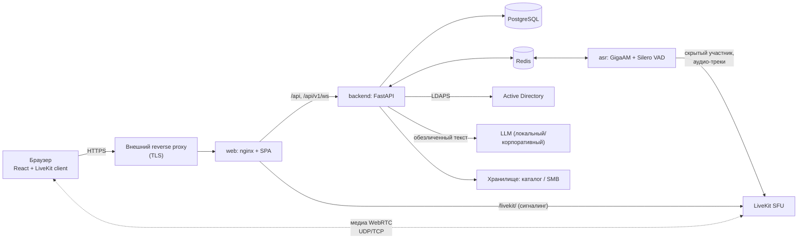

# Peregovorka — локальная голосовая переговорка с транскрибацией

Корпоративная веб-система переговорных комнат для **локальной сети**: голос, видео и показ экрана в браузере, распознавание речи
каждого участника отдельно, протоколы встреч, вход доменной учётной записью. Входа, звонков и распознавания речи через облачные сервисы
нет — всё работает на вашем сервере.

[](https://github.com/leonheard/peregovorka/actions)

---

## Содержание

1. [Для чего это](#для-чего-это)
2. [Возможности](#возможности)
3. [Как это устроено](#как-это-устроено)
4. [Требования](#требования)
5. [Быстрая установка](#быстрая-установка)
6. [Обновление и откат](#обновление-и-откат)
7. [Ежедневная эксплуатация](#ежедневная-эксплуатация)
8. [Конфигурация](#конфигурация)
9. [Безопасность и конфиденциальность](#безопасность-и-конфиденциальность)
10. [Данные и хранилище](#данные-и-хранилище)
11. [Версии и совместимость](#версии-и-совместимость)
12. [Документация](#документация)
13. [Состав репозитория](#состав-репозитория)
14. [Разработка и тесты](#разработка-и-тесты)
15. [Известные ограничения](#известные-ограничения)

---

## Для чего это

Нужна замена облачным видеоконференциям там, где данные не должны покидать периметр: сотрудники заходят в комнату под своей доменной
учёткой, говорят и показывают экран, а система в реальном времени расшифровывает, **кто и что сказал**, сохраняет историю встречи и по
запросу готовит протокол или краткое резюме (решения, поручения).

- **Свой сервер, свои данные.** Вход — Active Directory (LDAPS), медиа — собственный сервер LiveKit, распознавание — модель GigaAM на вашем CPU/GPU.
- **Протокол без утечек — или без обезличивания, как решите.** Пока обезличивание включено, текст для LLM проходит через него, а если оно не сработало — запрос в LLM не отправляется. Обезличивание можно выключить глобально или в отдельной переговорке: протоколы и резюме при этом создаются как обычно.
- **Аккуратное соседство.** Устанавливается в Docker рядом с другими проектами сервера, не трогая их (профиль `shared-host`), либо на чистый сервер (`standalone`).

## Возможности

### Комната и связь

- **Голос и видео** на базе LiveKit (WebRTC). Состояние каждого участника — микрофон, камера, «говорит сейчас» — видно в плитках текстом и цветом.
- **Показ экрана одним кликом** с выбором профиля: «Чёткость» (текст, слайды, код), «Сбалансированный» и «Плавность» (видео, анимация).
- **Просмотр чужого экрана как в просмотрщике изображений:**
  колесо мыши приближает и отдаляет **к точке под курсором**, перетаскивание сдвигает картинку, на сенсорном экране работает «щипок»,
  с клавиатуры — `+`, `−`, `0` (сброс) и стрелки. Отдалить меньше исходного вида нельзя, приблизить — до разумного предела (зависит от
  разрешения источника: от ×3 до ×10), сдвиг ограничен краями кадра. Дополнительно: «Вписать / Заполнить», полный экран (кнопка или двойной щелчок).
- **Мониторы разного размера.** Крупный экран на малой сцене остаётся читаемым за счёт масштабирования; при увеличении запрашивается слой высокого качества.
- **Круглые кнопки-пиктограммы** с подписями и эффектами: микрофон, камера, шумоподавление, показ экрана, запись, выход. Состояние видно сразу: включено, выключено, идёт трансляция или запись.
- **Микрофон без «драки»:** шумоподавление, эхоподавление и автоусиление включаются «на лету»; можно освобождать микрофон при выключении, чтобы им пользовались другие программы. Если микрофон занят другой программой, вход не блокируется —
  вы остаётесь в комнате без звука, видите причину (в том числе «монопольный режим» Windows) и можете повторить или выбрать другое устройство.
- **Устойчивое подключение:** при кратковременных сетевых сбоях и ошибках ICE (`could not establish pc connection`) первое подключение повторяется автоматически; для разбора жалоб данные о сети клиента попадают в журнал.
- **Понятные сообщения об ошибках устройств** (нет разрешения, устройство занято, нет HTTPS).
- **Этапы входа** показываются по шагам; вход не ждёт готовности распознавания — микрофон публикуется параллельно.

### Транскрибация

- **Каждый участник распознаётся отдельно** (отдельный микрофонный трек): в панели видно, кто и что сказал, со временем реплики.
- **GigaAM v3 E2E RNNT + Silero VAD** — русская речь, работает без интернета. Две модели одновременно: **Full (PyTorch)** — эталон качества — и
  **Q5_K_M (GGUF)** — быстрее и легче на CPU. Переключение — из админки, без перезапуска сервисов; при ошибке остаётся прежняя модель.
- **Измерения прямо в админке:** «Протестировать модель» и «Сравнить модели» на встроенной записи — скорость, коэффициент реального времени (RTF),
  загрузка CPU, память, качество слов (WER/CER) и пунктуация.
- **Настройка сегментации** (пауза речи, минимальная длительность и др.) меняется в админке на лету; параметры параллелизма и потоков — через `.env`.
- Тайминги каждого сегмента (ожидание VAD, очередь, инференс, сквозная задержка) пишутся в журнал и в метрики.

### Встречи, записи и протоколы

- **История встреч** с транскриптом по времени и участникам; доступ к завершённой встрече — по правилам (участники, админ, явные права, ограниченное по времени окно после встречи).
- **Запись** беседы по кнопке или автоматически; запись аудио по участникам; раздельные сроки хранения текста и аудио.
- **Протокол встречи** и **краткий протокол** (решения, поручения) через LLM — после обезличивания; инструкцию вы подтверждаете перед отправкой;
  шаблоны инструкций (общие и личные); просмотр, правка, удаление; экспорт в Markdown, TXT, DOCX, PDF.
- **Выгрузка** протоколов и записей в локальный каталог или на **SMB-ресурс** по структуре «комната / дата, день недели / время».
  Недоступное хранилище не теряет запись: файл остаётся, выгрузка повторяется автоматически и по кнопке.

### Доступ и администрирование

- **Вход доменной учёткой AD (LDAPS)**, права на комнаты по группам AD, необязательный пароль на комнату.
- **Админка** (параметры сгруппированы, у каждого поля есть пояснение и пример): комнаты, встречи, хранилище, обезличивание, LLM, экран,
  ASR-модели, пользователи, записи, журналы, «Состояние системы» и скачиваемый **диагностический отчёт без секретов**. Длинные списки — «бесконечной лентой», без страниц.
- **Несколько API** для языковой модели и для обезличивания: можно завести несколько, выбрать один «по умолчанию для всех» и назначить свой отдельной переговорке; обезличивание в переговорке включается, выключается или наследуется.
- **Журнал событий** для диагностики: входы и отказы, подключения, обрывы, медленная установка соединения, ошибки микрофона и камеры (с данными о браузере, сети и устройствах клиента), создание протоколов, действия администраторов.
  Фильтры с условиями «равно / не равно / содержит…», выбор записей флажками и удаление, выгрузка за сутки и полный архив за 30 дней, размер журнала на панели состояния. Хранится 30 дней (настраивается) и очищается автоматически;
  можно вести журнал во внешнем хранилище (диск или SMB) и не занимать место на сервере. Подробнее — [docs/JOURNAL_AND_SECURITY.md](docs/JOURNAL_AND_SECURITY.md).
- **Журнал аудита** важных действий (включая удаление протоколов) — неизменяемый.

### Эксплуатация

- **Установка мастером** одной командой, проверка сервера до установки (`preflight`), план перед применением.
- **Штатное обновление одной командой** `./scripts/update.sh` с резервной копией `.env` и БД, миграциями Alembic, ожиданием готовности сервисов,
  проверкой и сквозным тестом; откат `./scripts/rollback.sh` с защитой от несовместимой версии базы.
- **Проверки:** `verify.sh` (состояние), `smoke-test.sh` (сквозной тест: LiveKit `/rtc/v1`, прокси, WebSocket, ASR, LDAP, TLS, порты), `diag.sh` (отчёт).
- **Рекомендации по ядру и ASR** выводятся предупреждениями, настройки хоста автоматически не меняются.

## Как это устроено



Сервисы Docker Compose: `postgres`, `redis`, `livekit`, `backend`, `asr`, `web`.

**Сквозной путь:** вход через AD → список комнат по правам → `join` (встреча, команда ASR, токен LiveKit; ожидания ASR нет) → браузер открывает
LiveKit и канал событий параллельно → ASR подключается как скрытый участник, берёт микрофонные треки → VAD режет речь на сегменты → очередь → GigaAM →
реплика сохраняется в БД и по WebSocket появляется в панели.

Принятые решения и причины — в [ARCHITECTURE.md](ARCHITECTURE.md); контракт backend ⇄ ASR — в [docs/ASR_CONTRACT.md](docs/ASR_CONTRACT.md).

### Технологии

| Слой | Стек |
| --- | --- |
| Backend | Python 3.12, FastAPI, SQLAlchemy (async), Alembic, PostgreSQL 16, Redis 7 |
| Frontend | React 19, TypeScript, Vite, livekit-client, шрифт IBM Plex Sans (локально) |
| Медиа | LiveKit Server (закреплённая проверенная версия) |
| Распознавание | GigaAM v3 E2E RNNT (PyTorch / GGUF), Silero VAD |
| Развёртывание | Docker Compose, Bash-скрипты, nginx |

## Требования

| | Минимум | Комментарий |
| --- | --- | --- |
| ОС | Ubuntu 24.04 (или совместимый Linux) | Docker и Docker Compose v2 |
| CPU | 4 vCPU | для 8 vCPU и более — свободнее запас на распознавание; параметры потоков описаны в `.env.example` |
| RAM | 8 ГБ | распознавание Full-моделью занимает основную часть |
| Диск | 20 ГБ и больше | образы, модели GigaAM, записи |
| Сеть | LDAPS до AD, исходящий доступ к GitHub/PyPI/npm/Docker Hub **только на этапе сборки** | в работе — только локальная сеть |
| HTTPS | обязателен | браузер отдаёт микрофон только в защищённом контексте; TLS — на внешнем reverse proxy |

Для закрытых сетей веса моделей можно положить вручную (`scripts/models.sh --from-dir`).

## Быстрая установка

```bash
git clone --depth 1 https://github.com/leonheard/peregovorka.git /var/www/projects/peregovorka \
  && cd /var/www/projects/peregovorka \
  && scripts/setup.sh --profile shared-host
```

Мастер задаёт вопросы, подбирает свободные порты, создаёт `.env` с секретами, проверяет сервер (`preflight`), показывает план и применяет
его **только после вашего подтверждения**. Для чистого сервера — `--profile standalone`.

| Профиль | Когда |
| --- | --- |
| `shared-host` | на сервере уже работают другие проекты: ничего чужого не трогается, порты подбираются свободные, нет `prune`, правок чужих nginx и автоматических sysctl |
| `standalone` | чистый сервер под одну Peregovorka |

Подробное пошаговое руководство, включая ручную установку и разбор типичных проблем: [docs/INSTALL_AND_UPDATE.md](docs/INSTALL_AND_UPDATE.md).

<details>
<summary>Ручная установка (коротко)</summary>

```bash
cp .env.example .env && chmod 600 .env && $EDITOR .env
scripts/models.sh                  # веса GigaAM в $DATA_ROOT (или --from-dir для закрытой сети)
scripts/preflight.sh               # только проверка, ничего не меняет
scripts/install.sh --profile shared-host --dry-run   # план; затем без --dry-run
scripts/smoke-test.sh
```

Для shared-host прочитайте [DEPLOYMENT.md](DEPLOYMENT.md), раздел 7, до запуска.
</details>

## Обновление и откат

`update.sh` — единственный рекомендуемый способ обычного обновления. `install.sh` нужен для первой установки и явных repair/reconfigure-этапов.

```bash
./scripts/check-updates.sh     # что нового: commit'ы, новые параметры .env, миграции, версии (ничего не меняет)
./scripts/update.sh --dry-run  # показать план
./scripts/update.sh            # обновить
```

Что делает `update.sh`: проверяет `origin/main` и показывает новые commit'ы → **останавливается при локальных изменениях** (ничего не прячет молча) →
делает копию `.env` и сравнивает его с `.env.example` (дописывает только безопасные новые параметры, остальное показывает списком; секреты не печатаются) →
`git merge --ff-only` → проверяет модели (повторно не скачивает) → делает резервную копию БД → собирает образы с реальным commit и временем сборки
(повторы при сетевых сбоях, запасной режим сборки) → применяет миграции Alembic → поднимает сервисы и **ждёт healthcheck** → `verify` → `smoke-test` → краткий итог.

Чего скрипт не делает никогда: `git reset --hard`, удаление `DATA_ROOT`, моделей или тома PostgreSQL, перезапись `.env`, повторную «чистую» установку.

```bash
./scripts/rollback.sh          # вернуться к предыдущей версии (образы сохранены)
```

> **Git rollback ≠ database rollback.** Если ревизия базы данных неизвестна старой версии кода, откат останавливается и показывает путь к резервной копии БД.
> Прерванное обновление повторяется той же командой `./scripts/update.sh`.

Подробно (первая установка, обновление моделей, сетевые проблемы, миграции, восстановление после прерывания): [docs/INSTALL_AND_UPDATE.md](docs/INSTALL_AND_UPDATE.md).

## Ежедневная эксплуатация

| Команда | Что делает |
| --- | --- |
| `./scripts/check-updates.sh` | проверка обновлений, ничего не меняет |
| `./scripts/update.sh` | штатное обновление |
| `./scripts/verify.sh` | проверка состояния: FAIL → код 1, WARN и PASS → код 0 |
| `./scripts/smoke-test.sh` | сквозной тест: LiveKit `/rtc/v1`, прокси, WebSocket, ASR, LDAP, TLS, порты |
| `./scripts/diag.sh` | диагностический отчёт без секретов |
| `./scripts/ctl.sh status` | состояние сервисов (также `start`, `stop`, `restart`; журналы — `./scripts/logs.sh`) |
| `./scripts/backup.sh` / `restore.sh` | резервная копия и восстановление БД |
| `./scripts/models.sh` | загрузка весов моделей |
| `./scripts/asr-bench.sh --concurrency 1,2` | замер: сколько параллельных распознаваний выгодно на вашем CPU |
| `./scripts/tune-kernel.sh` | рекомендации по настройкам ядра (применять — решение администратора) |
| `./scripts/collect-metrics.sh` | сбор метрик для приёмочного теста |

## Конфигурация

Все параметры — в `.env` (шаблон и пояснения — [.env.example](.env.example)). Секреты в Git не попадают (`.env` в `.gitignore`).
Часть настроек (хранилища, LLM, обезличивание, ASR-модель, сегментация, комнаты) меняется в админке и хранится в БД.

Ключевые группы: `DATA_ROOT` (каталог данных), порты и внешний адрес (`*_PORT`, `PUBLIC_URL`), LDAP/AD, LiveKit (`LIVEKIT_IMAGE_TAG` закреплён на
проверенной версии), ASR (`ASR_MODEL_ID`, `ASR_CPU_THREADS`, `ASR_INTEROP_THREADS`, `ASR_MAX_CONCURRENT_INFERENCE`).

> Произведение `ASR_CPU_THREADS × ASR_MAX_CONCURRENT_INFERENCE` не должно превышать число ядер: иначе распознавания мешают друг другу и растёт задержка.
> При обновлении эти значения **автоматически не меняются** — только предупреждение и рекомендация запустить `asr-bench.sh`.

## Безопасность и конфиденциальность

- Пароли и ключи (мастер-ключ приложения, пароль привязки LDAP, Redis, ключи LiveKit, токены) хранятся только в `.env` (права 600) и никогда не печатаются скриптами и диагностикой — выводы маскируются.
- Вход — LDAPS; сессии на сервере; права на комнаты — по группам AD; доступ к чужим встречам по прямому адресу невозможен. Логин принимается только из допустимых символов (буквы, цифры, `. _ -`), после 20 неверных вводов вход блокируется на 5 минут (настраивается в `.env`).
- Если обезличивание включено, в LLM уходит только **обезличенный** текст, а при сбое обезличивания запрос не отправляется (fail closed). Если администратор выключил его (глобально или для комнаты), текст уходит как есть — окно «Сформировать протокол» об этом предупреждает.
- Диагностический отчёт собирается без паролей и ключей.
- На shared-host проект не вмешивается в чужие сервисы: отдельный Compose-проект (своё имя и сеть), свободные порты, собственные конфигурации nginx с маркером принадлежности.

## Данные и хранилище

Все данные — в `DATA_ROOT` (по умолчанию внутри каталога проекта на shared-host): база PostgreSQL, модели GigaAM, записи, резервные копии, состояние
обновлений. Обновление и откат **не удаляют** этот каталог. Протоколы и записи можно выгружать в локальный каталог или на SMB; сроки хранения текста и аудио задаются раздельно.

## Версии и совместимость

Проверенный набор: **LiveKit Server v1.13.7**, `livekit-client` 2.22.3 (браузер), Python SDK `livekit` 1.1.20 и `livekit-api` 1.2.1.
Старый сервер LiveKit опасен: клиенты пробуют путь `/rtc/v1`, и при ответе 404 вход замедляется на секунды. Поэтому в production версия
**закреплена**, `latest` не используется, а `smoke-test.sh` проверяет `/rtc/v1` реальным WebSocket Upgrade. Остальные зависимости заданы диапазонами
(от проверенной до следующего мажорного выпуска). Подробности — [docs/COMPATIBILITY.md](docs/COMPATIBILITY.md).

## Документация

| Документ | О чём |
| --- | --- |
| [docs/INSTALL_AND_UPDATE.md](docs/INSTALL_AND_UPDATE.md) | установка, обновление, откат, сетевые проблемы, восстановление |
| [DEPLOYMENT.md](DEPLOYMENT.md) | порты, AD, данные, nginx, диагностика, shared-host |
| [ARCHITECTURE.md](ARCHITECTURE.md) | архитектура и принятые решения |
| [PROJECT.md](PROJECT.md) | фактическое состояние проекта |
| [HISTORY.md](HISTORY.md) | журнал изменений |
| [.env.example](.env.example) | все переменные конфигурации с пояснениями |
| [docs/COMPATIBILITY.md](docs/COMPATIBILITY.md) | версии LiveKit и SDK, политика обновлений |
| [docs/JOURNAL_AND_SECURITY.md](docs/JOURNAL_AND_SECURITY.md) | журнал событий, API-профили, обезличивание по желанию, защита входа |
| [docs/ACCEPTANCE_TEST.md](docs/ACCEPTANCE_TEST.md) | приёмочный тест (3 клиента, 20–30 минут) |
| [docs/realtime-performance-audit.md](docs/realtime-performance-audit.md) | аудит производительности и realtime |
| [docs/ASR_CONTRACT.md](docs/ASR_CONTRACT.md) | контракт backend ⇄ ASR |
| [docs/MIGRATIONS.md](docs/MIGRATIONS.md) | миграции БД и резервные копии |
| [docs/AUDIT.md](docs/AUDIT.md) | аудит интерфейса |

## Состав репозитория

| Каталог | Содержимое |
| --- | --- |
| `backend/` | FastAPI: AD-вход, сессии, комнаты и права, встречи, токены LiveKit, WebSocket, админ-API, аудит, хранилище/SMB, протоколы (обезличивание → LLM), записи, сроки хранения; `migrations/` (Alembic), `tests/` |
| `asr-service/` | ASR: провайдеры и runtime (PyTorch, GGUF), менеджер моделей, VAD-сегментация, очередь инференса, LiveKit-воркер, health; `tests/` |
| `frontend/` | React + TypeScript (Vite): вход, комнаты, комната (показ экрана с масштабированием, запись, транскрипция), история и протоколы, админка |
| `deployment/` | `compose.yml`, образ LiveKit, шаблоны nginx, `compat.env` (проверенные версии) |
| `scripts/` | `setup`, `install`, `update`, `check-updates`, `rollback`, `preflight`, `verify`, `smoke-test`, `diag`, `backup`, `restore`, `models`, `ctl`, `tune-kernel`, `asr-bench`, `collect-metrics`; `lib/` — общие функции |
| `tests/scripts/` | тесты Bash-скриптов на подставном docker |
| `docs/` | эксплуатационная документация; `docs/legacy/` — архив старого проекта |
| `legacy/` | прежний PHP-проект (AI-чат) — источник для переноса, будет удалён |

## Разработка и тесты

```bash
# backend (Python 3.12+)
cd backend && pip install -r requirements-dev.txt && pytest

# ASR (torch и GigaAM не нужны: используются подставные провайдер и VAD)
cd asr-service && pip install -r requirements-dev.txt && pytest

# frontend
cd frontend && npm ci && npm test && npm run build

# скрипты
bash tests/scripts/run.sh
```

LDAP в unit-тестах подменяется (`FakeDirectory`), реальный AD не используется; скрипты обновления проверяются на подставном docker и временном git-репозитории.
Непрерывная проверка (GitHub Actions) запускает те же четыре набора: backend, ASR, frontend, скрипты.

## Известные ограничения

- Группы пользователя в сессии обновляются при входе, а не «на лету».
- Сегменты, отброшенные при перегрузке распознавания, не восстанавливаются (это видно в метриках).
- Один сервер LiveKit без кластера — целевой масштаб: односерверный корпоративный контур.
- Микрофон в браузере требует HTTPS — TLS на внешнем reverse proxy обязателен.
- Штатное обновление `update.sh` проверено на подставных docker и git; на реальном сервере его первый запуск рекомендуется начать с `--dry-run`.
