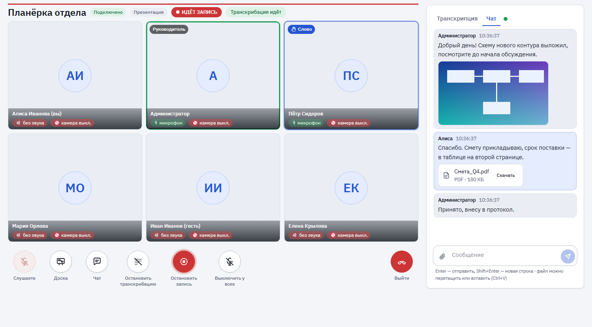
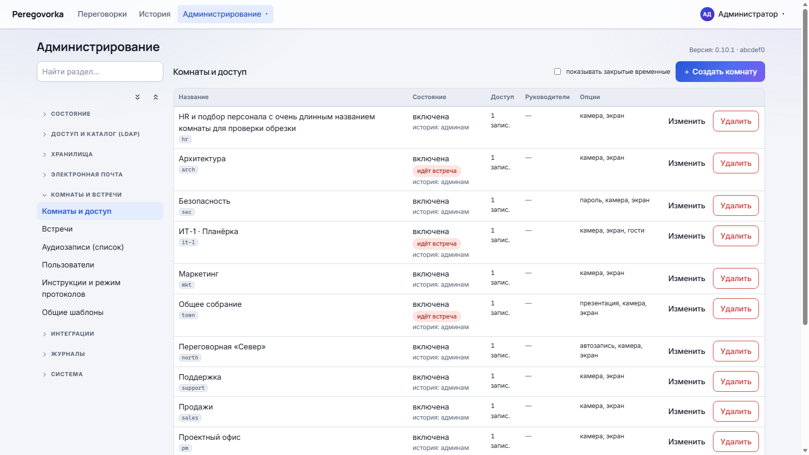

<div align="center">

# Peregovorka

### Self-hosted видеовстречи со стенограммой, протоколами, локальным AI и корпоративными интеграциями

Сотрудники входят доменной учётной записью, речь каждого участника автоматически превращается в текст, а после встречи готовы протокол, резюме и карта разговора.
Всё работает на вашем сервере: записи, тексты и учётные данные наружу не уходят.

[](https://github.com/calleograph/peregovorka/actions)
[](https://github.com/calleograph/peregovorka/releases)



</div>

---

|  |  |
| --- | --- |
| 🎥 **Видеовстречи** | голос, видео и несколько демонстраций экрана одновременно; своя раскладка у каждого, «показать всем» у ведущего |
| 📝 **Стенограмма** | «кто что сказал» — речь каждого участника распознаётся отдельно, на русском, без интернета |
| 📋 **Протоколы и резюме** | решения, задачи «кто — что — срок», открытые вопросы; у каждого пункта — реплика-источник |
| 🧠 **Локальный AI** | встроенная модель работает на вашем сервере; внешние модели — по желанию, с обезличиванием |
| 🗺 **Карта разговора** | темы встречи на шкале времени, кто сколько говорил, переход к нужной реплике |
| ⏺ **Запись** | запись звука встречи по кнопке или автоматически; после встречи — одна общая аудиозапись со всеми участниками, которую можно прослушать прямо в истории |
| ✏️ **Общая доска** | схемы и диаграммы (draw.io) вместе во время встречи; сохраняются с материалами |
| 🔌 **API** | публичный API, события (webhooks), фоновое формирование документов |
| 🏢 **Active Directory и Bitrix24** | вход доменной учётной записью, доступ по группам, профили сотрудников с портала |
| ☎️ **SIP** | звонок с телефона во встречу и из встречи на телефон через вашу АТС |
| 🎨 **Свой вид** | название, логотип, цвета, документы и контакты вашей организации — через браузер; темы для пользователей |
| 🔒 **Self-hosted и безопасность** | данные на вашем сервере, журнал аудита, права проверяет сервер |

## Быстрый старт

Нужен сервер с чистой **Ubuntu 24.04** или Debian 12/13, **от 4 процессоров и 8 ГБ памяти**, доступ в интернет и права `sudo`. Docker, nginx и всё остальное установщик поставит сам.

```bash
wget -O install.sh https://raw.githubusercontent.com/calleograph/peregovorka/main/install.sh
chmod +x install.sh
sudo ./install.sh
```

Установка занимает 10–30 минут и заканчивается проверкой всех сервисов и сообщением **«УСТАНОВКА ЗАВЕРШЕНА»** с адресом и одноразовым паролем администратора.
Дальше всё делается в браузере: мастер первоначальной настройки проведёт через подключение к домену, сертификаты, группы, хранилище и почту.
Прервалось — запустите `sudo ./install.sh` ещё раз: готовые шаги пропускаются. Потеряли пароль администратора — `sudo /opt/peregovorka/scripts/admin-reset.sh`.

Параметры установщика, установка на сервер, где уже работают другие сервисы, и восстановление доступа — [docs/INSTALL_AND_UPDATE.md](docs/INSTALL_AND_UPDATE.md).

## Возможности

- **Комната на весь экран.** Сцена занимает всю ширину окна, панель управления — один компактный ряд, доска «Развернуть» на всё окно, на телефоне вся встреча без прокрутки.
- **Комната встречи.** Несколько демонстраций экрана одновременно, закрепление участников и демонстраций для себя, «показать всем» у ведущего, раскладки «Авто / Сетка / Сцена / Рядом», полный экран и «картинка в картинке», плавные переходы без перезапуска видео.
- **Управление встречей.** Руководитель комнаты выключает микрофоны и камеры, останавливает демонстрацию экрана, даёт слово в презентационной комнате, снимает поднятую руку, удаляет участника. «Заглушить для себя» доступно каждому.
- **Стенограмма и чат** в правой панели одновременно; файлы и картинки в чате; чат и доска учитываются в протоколе.
- **Документы после встречи:** протокол, резюме и карта разговора — в Word, PDF, HTML, Markdown; рассылка участникам по шаблону письма.
- **Модели на выбор:** встроенная локальная Qwen3 1.7B или внешние API — отдельно для протокола и резюме, на уровне системы, комнаты и встречи.
- **Гостевой доступ** по ссылке без учётной записи, временные переговорки, презентационные комнаты.
- **Администрирование в браузере:** LDAPS и сертификаты, доступ по группам, хранилища (каталог или SMB), почта, журнал событий, обновление в один клик и по расписанию — не прерывая идущие встречи.

## Скриншоты



<sub>Снимки сделаны на тестовом стенде с вымышленными данными.</sub>

## Архитектура

Браузер (React + LiveKit) → nginx → backend (FastAPI) с PostgreSQL и Redis; звук и видео идут через LiveKit (WebRTC), распознавание речи — отдельный сервис GigaAM, документы формирует локальная или внешняя языковая модель.
Всё запускается в Docker Compose; обновление из браузера выполняет небольшой помощник на сервере, контейнеры доступа к Docker не получают. Подробно — [docs/INTERNALS.md](docs/INTERNALS.md).

## API

Публичный API `/api/public/v1` (по умолчанию выключен): ключи с правами и ограничением по комнатам, встречи, участники, стенограмма (JSON, TXT, Markdown, VTT, SRT), протоколы, резюме, карта разговора, записи и чат;
события (webhooks) с подписью и повторами; фоновое формирование документов; OpenAPI 3.1 и справочная страница. Пошаговое руководство — [docs/api/README.md](docs/api/README.md).

## Интеграции

| Интеграция | Что даёт | Документация |
| --- | --- | --- |
| Active Directory (LDAPS) | вход доменной учётной записью, доступ и роли по группам, профиль сотрудника | [docs/ADMIN_SETUP.md](docs/ADMIN_SETUP.md) |
| Bitrix24 | должность, подразделение, телефон и фото с корпоративного портала | [docs/BITRIX24.md](docs/BITRIX24.md) |
| SIP / АТС | телефонные участники встречи | [docs/SIP.md](docs/SIP.md) |
| Почта (SMTP) | рассылка материалов встречи | [docs/MAIL.md](docs/MAIL.md) |
| SMB / каталог | хранение записей, документов и вложений | [docs/STORAGE.md](docs/STORAGE.md) |
| Внешние LLM | протоколы и резюме внешней моделью, с обезличиванием по желанию | [docs/LOCAL_LLM.md](docs/LOCAL_LLM.md) |

## Установка

Сервер: Ubuntu 24.04 или Debian 12/13, от 4 vCPU, 8 ГБ RAM, 20 ГБ диска. Участникам нужны **443/tcp** (HTTPS) и порты звонков LiveKit (UDP и TCP из `.env`); телефония использует отдельные порты только для вашей АТС.
Обновление — «Администрирование → Обновления и версии → Обновить проект» или `sudo ./scripts/update.sh`. Подробно: [docs/INSTALL_AND_UPDATE.md](docs/INSTALL_AND_UPDATE.md), порты и сеть — [DEPLOYMENT.md](DEPLOYMENT.md).

## Безопасность

Данные и модели — на вашем сервере; права проверяет сервер, а не интерфейс; действия администраторов и руководителей попадают в журнал аудита; секреты хранятся зашифрованными;
публичный API выключен по умолчанию и защищён от обращений во внутреннюю сеть. Результаты аудита — [docs/SECURITY_AUDIT.md](docs/SECURITY_AUDIT.md), HTTPS и HSTS — [docs/HTTPS_AND_HSTS.md](docs/HTTPS_AND_HSTS.md).

## Документация

| Документ | О чём |
| --- | --- |
| [CHANGELOG.md](CHANGELOG.md) | что нового в каждой версии |
| [docs/INSTALL_AND_UPDATE.md](docs/INSTALL_AND_UPDATE.md) | установка, обновление, откат, восстановление доступа |
| [docs/SITE_SETTINGS.md](docs/SITE_SETTINGS.md) | оформление под организацию: название, логотип, документы, контакты, темы |
| [docs/ADMIN_SETUP.md](docs/ADMIN_SETUP.md) | первая настройка в браузере |
| [docs/ROOMS_AND_ROLES.md](docs/ROOMS_AND_ROLES.md) | роли, комнаты, сцена встречи, модерация |
| [docs/COLLABORATION.md](docs/COLLABORATION.md) | общая доска, чат, гостевой доступ |
| [docs/RECORDINGS.md](docs/RECORDINGS.md) | общая запись встречи, плеер в истории, что не сделано (видео) |
| [docs/LOCAL_LLM.md](docs/LOCAL_LLM.md) | локальная модель и протоколы |
| [docs/MAPS_AND_KNOWLEDGE.md](docs/MAPS_AND_KNOWLEDGE.md) | карта разговора |
| [docs/api/README.md](docs/api/README.md) | публичный API и события |
| [docs/INTERNALS.md](docs/INTERNALS.md) | устройство системы, данные, ограничения |
| [docs/VERSIONING.md](docs/VERSIONING.md) | версии и выпуск релизов |
| [HISTORY.md](HISTORY.md) | технический журнал разработки |
