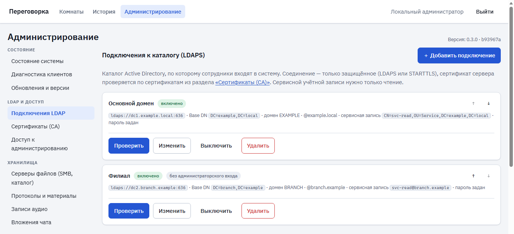

<div align="center">

# 🎙 Peregovorka

### Локальная голосовая переговорка с транскрибацией, протоколами и общей доской

Видео- и аудиовстречи для корпоративной сети: вход доменной учётной записью, распознавание речи каждого участника, чат, общая доска для схем, гостевой доступ по ссылке
и протоколы встреч по вашей инструкции. Данные остаются на вашем сервере.

[](https://github.com/calleograph/peregovorka/actions)
[](https://github.com/calleograph/peregovorka/releases)


<sub>Презентационная комната: у Петра есть слово, у Администратора — роль руководителя; чат с картинкой и файлом. Чат — настоящий компонент, плитки и кнопки — макет (стенд без звонков).</sub>

</div>

---

## Что это

Peregovorka — собственный сервис видеовстреч для организации: сотрудники входят доменной учётной записью, речь каждого участника автоматически превращается в текст, а после встречи
по вашей инструкции составляется протокол. Всё работает на вашем сервере: записи, тексты и учётные данные наружу не уходят.

## Быстрый старт

**Что нужно:** один сервер с чистой **Ubuntu 24.04** (подойдёт и Debian 12/13), **не меньше 4 процессоров и 8 ГБ памяти**, доступ в интернет и права `root`/`sudo`.
**Больше ничего устанавливать заранее не нужно** — ни Docker, ни веб-сервер, ни git: установщик поставит всё сам.

Подключитесь к серверу по SSH и выполните:

```bash
wget -O install.sh https://raw.githubusercontent.com/calleograph/peregovorka/main/install.sh
chmod +x install.sh
sudo ./install.sh
```

**Что произойдёт.** Установщик покажет план и спросит «Продолжить?». Затем сам: определит систему, поставит Docker, nginx и нужные утилиты, настроит сеть сервера для звука и видео, скачает проект
и модели (распознавание речи и встроенная локальная языковая модель), соберёт и запустит сервисы, подготовит базу данных, **проверит, что всё работает**, и создаст администратора. Это занимает 10–30 минут — дождитесь конца.
Если что-то прервётся, запустите `sudo ./install.sh` ещё раз: готовые шаги пропускаются.

**Чем закончится.** Только когда проверка пройдена, появится сообщение **«УСТАНОВКА ЗАВЕРШЕНА»**: состояние сервисов, базы данных, распознавания речи, звонков и веб-интерфейса — и блок с данными для входа:

```text
╔══════════════════════════════════════════════════════════════════════╗
  ПЕРВИЧНЫЙ ВХОД В PEREGOVORKA
╚══════════════════════════════════════════════════════════════════════╝
  URL:                      https://192.0.2.10
  Локальный администратор:  admin
  Первичный пароль:         ************************

  СОХРАНИТЕ ЭТИ ДАННЫЕ. ПАРОЛЬ ПОКАЗЫВАЕТСЯ ТОЛЬКО СЕЙЧАС.
```

Пароль случайный, нигде не записывается (ни в файлы, ни в журналы) и больше не покажется. Потеряли — [как восстановить](#потеряли-пароль-администратора).

**Что делать дальше — всё в браузере.** Откройте адрес и войдите (браузер предупредит о сертификате — это нормально: временный самоподписанный сертификат можно заменить своим). Система попросит
сменить пароль, а **мастер первоначальной настройки** проведёт по шагам: подключение к домену (LDAPS) → сертификаты → группы администраторов → файловое хранилище (SMB) → исходящая почта → проверка системы.
Любой шаг можно пропустить и вернуться позже. **Заходить на сервер для обычной настройки и обновления больше не нужно:** обновления, проверка состояния и исправление типичных проблем
(кнопка «Исправить автоматически») — в разделе «Администрирование».

<details>
<summary><b>Параметры установщика</b> (все необязательны)</summary>

| Параметр | Что делает |
| --- | --- |
| `--host имя_или_IP` | под каким адресом сервер открывают в браузере (по умолчанию — основной IP сервера) |
| `--https-port 443` | порт HTTPS |
| `--dir /opt/peregovorka` | куда установить проект |
| `--data /srv/peregovorka-data` | где хранить данные (база, записи, сертификаты) |
| `--ref vX.Y.Z` | какую версию ставить (по умолчанию — последний релиз; `main` — самая свежая разработка) |
| `--skip-models` | не скачивать модель распознавания речи сейчас (позже `scripts/models.sh`) |
| `--yes` | не задавать вопросов |

Пример: `sudo ./install.sh --host meet.example.local --yes`.
</details>

> Это путь для **отдельного сервера**. Если на сервере уже работают другие сайты и сервисы (nginx, Docker, свои порты), используйте [установку на общий сервер](docs/INSTALL_AND_UPDATE.md#shared-host--экспертная-установка) — там ничего не ставится и не меняется без вашего решения.

### Потеряли пароль администратора?

На сервере, от `root`, выполните:

```bash
sudo /opt/peregovorka/scripts/admin-reset.sh
```

Скрипт выдаст **новый** пароль локального администратора, завершит его старые сеансы и запишет событие в журнал аудита. Он не требует ни доменной учётной записи, ни работающего LDAP, ни правки базы данных вручную.

## Обновление

Проще всего — в браузере: **Администрирование → Обновления и версии → «Обновить проект»**. То же самое в терминале:

```bash
cd /opt/peregovorka
sudo ./scripts/update.sh
```

Скрипт проверит, что изменилось на GitHub, покажет разницу версий, сделает копию данных, обновит образы и перезапустит сервисы. Итог показывается раздельно: **обновление · сервисы · проверка интеграций**
(например, если домен временно недоступен, обновление всё равно считается успешным, а рядом появится кнопка диагностики). Типичные проблемы после обновления (права на каталоги, устаревшая настройка веб-сервера)
находятся и исправляются кнопкой «Исправить автоматически». Что изменилось от версии к версии — в [CHANGELOG.md](CHANGELOG.md). Установщик `install.sh` для обновления **не нужен**.

## Возможности

- **Голос, видео и показ экрана** в браузере; чужой экран можно приближать колесом мыши.
- **Стенограмма «кто что сказал»:** речь каждого участника распознаётся отдельно, на русском языке, без интернета.
- **Протоколы и резюме** без внешних сервисов: встроенная локальная модель **Qwen3 1.7B** работает на вашем сервере, данные не уходят наружу. Протокол собирается из проверенных пунктов (решения, поручения «кто — что — срок», предложения, открытые вопросы), у каждого пункта указана реплика-источник; чего нет в репликах — «не указан». Для протокола и для резюме можно выбрать разные модели (локальная, внешняя LLM или отключено) на уровне системы, комнаты и встречи; для внешней модели обезличивание текста — по желанию.
- **Материалы встречи по почте:** протокол, резюме и стенограмма (по желанию одним архивом) уходят после встречи тем, кого выбрал руководитель комнаты (адреса — из каталога или вручную); значения комнаты можно изменить для конкретной встречи; письма идут через очередь с повторами.
- **Своя языковая модель для комнаты и встречи:** система → комната → встреча; удалённая модель не ломает комнату.
- **Телефония (необязательно):** звонок телефона в комнату и звонок из комнаты на телефон через собственный LiveKit SIP и вашу АТС (Asterisk и др.); участник отображается как «Телефон: …», речь попадает в стенограмму. По умолчанию выключена — [docs/SIP.md](docs/SIP.md).
- **Общая доска** для схем и диаграмм (на основе draw.io): рисуют все участники, схема сохраняется со встречей; выгрузка PNG, SVG, PDF и `.drawio`.
- **Чат комнаты:** ссылки, копирование, история, файлы и картинки (кнопка, перетаскивание, Ctrl+V); чат и схема учитываются при составлении протокола.
- **Гостевой доступ по ссылке** без учётной записи — включается для каждой комнаты отдельно, ссылку можно отозвать.
- **Руководители комнат работают самостоятельно:** «Настройки комнаты» (разделы: основное, встреча и запись, доступ и гости, материалы после встречи, языковая модель, телефония), режим «презентация» с «дать слово», управление участниками.
- **Хранилища и сверка:** каталог или SMB-ресурс настраиваются один раз; система регулярно сверяет базу с реальными файлами и перестаёт предлагать то, что удалили вручную.
- **Всё настраивается в браузере:** LDAPS-подключения и сертификаты CA, группы администраторов, хранилища, почта. Локальный администратор не зависит от домена, поэтому сбой каталога не лишает вас управления.

## Интерфейс



<sub><b>Администрирование → LDAP и доступ → Подключения LDAP:</b> несколько подключений, пароль сервисной учётной записи не показывается («пароль задан»), кнопки «Проверить» и «Изменить». Снимок сделан на тестовом стенде с вымышленными данными (example.local).</sub>

## Требования и порты

Сервер с Ubuntu 24.04 или Debian 12/13, от 4 vCPU, 8 ГБ RAM, 20 ГБ диска. Docker, nginx и все нужные утилиты установщик поставит сам. Для работы микрофона и камеры в браузере нужен **HTTPS** — он включается автоматически.
Участникам — в офисе, снаружи или через VPN — нужны **443/tcp** (HTTPS), а также **UDP- и TCP-порты звонков** (`LIVEKIT_UDP_PORT`, `LIVEKIT_TCP_PORT` из `/opt/peregovorka/.env`) прямо до сервера;
остальные порты наружу не открываются. Телефония (если включите) использует **отдельные** порты SIP и RTP только для вашей АТС — см. [docs/SIP.md](docs/SIP.md). Подробности и особенности VPN (в том числе MTU) — в [docs/INTERNALS.md](docs/INTERNALS.md#сеть-что-должно-быть-доступно-участникам).

Сервер уже занят другими сайтами или сервисами (свой nginx, Docker, свои порты)? Это экспертный случай — установка с профилем `shared-host`, где ничего не ставится и не меняется без вашего решения: [docs/INSTALL_AND_UPDATE.md](docs/INSTALL_AND_UPDATE.md#shared-host--экспертная-установка).

## Документация

| Документ | О чём |
| --- | --- |
| [CHANGELOG.md](CHANGELOG.md) | что нового от версии к версии |
| [docs/INSTALL_AND_UPDATE.md](docs/INSTALL_AND_UPDATE.md) | установка (обычная и для общего сервера), обновление, «Исправить автоматически», откат, восстановление доступа |
| [docs/ADMIN_SETUP.md](docs/ADMIN_SETUP.md) | первая настройка в браузере: LDAP, сертификаты, группы, хранилище, почта |
| [docs/MAIL.md](docs/MAIL.md) | исходящая почта и доставка материалов встреч |
| [DEPLOYMENT.md](DEPLOYMENT.md) | порты, AD, данные, nginx, диагностика |
| [docs/COLLABORATION.md](docs/COLLABORATION.md) | общая доска, чат, гостевой доступ |
| [docs/ROOMS_AND_ROLES.md](docs/ROOMS_AND_ROLES.md) | роли, презентационные комнаты, «дать слово», настройки комнаты |
| [docs/SIP.md](docs/SIP.md) | SIP-телефония: схема, порты, безопасность, настройка Asterisk, диагностика |
| [docs/LOCAL_LLM.md](docs/LOCAL_LLM.md) | встроенная локальная модель Qwen3 1.7B: установка, структурное извлечение протокола, раздельный выбор модели для протокола и резюме, ограничения |
| [docs/STORAGE.md](docs/STORAGE.md) | хранилища файлов (SMB, каталог), вложения чата, сверка с хранилищем |
| [docs/INTERNALS.md](docs/INTERNALS.md) | устройство, безопасность, данные, состав репозитория, тесты, ограничения |
| [docs/VERSIONING.md](docs/VERSIONING.md) | версии и выпуск релизов |
| [.env.example](.env.example) | все параметры конфигурации |
